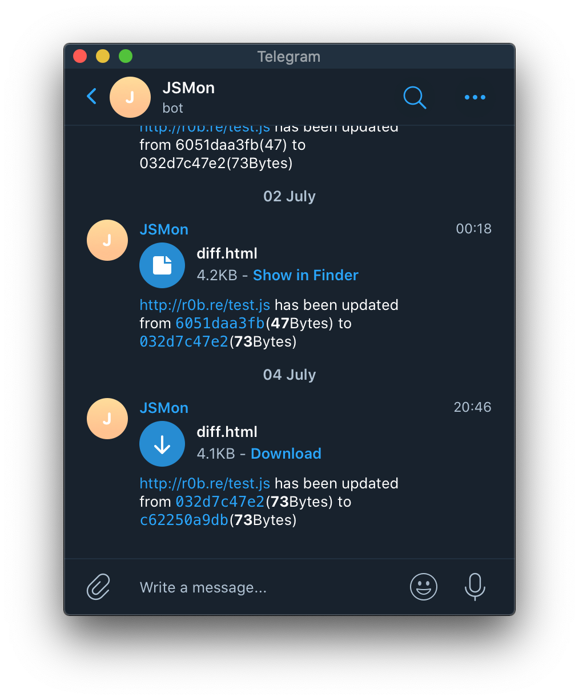
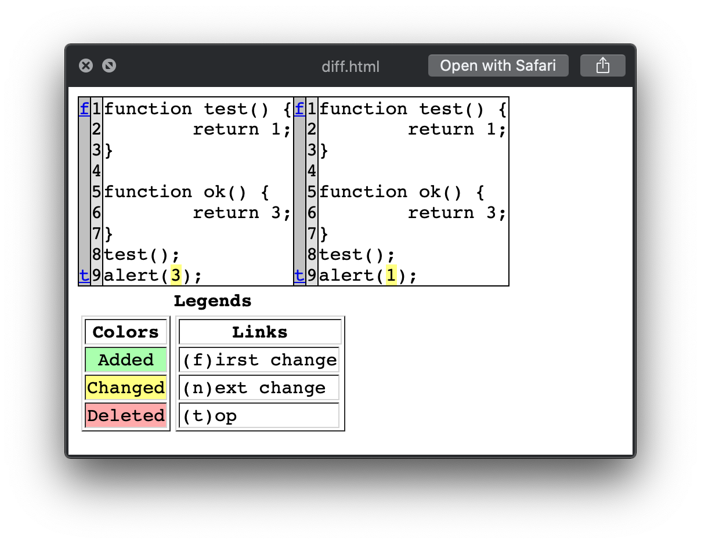

# JSMonWin
JSMonWin - JavaScript Change Monitor for BugBounty in Windows

Using this script, you can configure a number of JavaScript files on websites that you want to monitor. Everytime you run this script, these files will be fetched and compared to the previously fetched version. If they have changed, you will be notified via Telegram with a message containing a link to the script, the changed filesizes, and a diff file to inspect the changes easily.





## Installation

To install JSMon:
```bash
git clone https://github.com/sl4x0/jsmonwin.git 
cd jsmonwin
python setup.py install
```
You need to set up your Slack or Telegram token in the Environment, e.g. by creating a `.env` File:
`vscode => New File => .env`
With The Contents:
```
JSMONWIN_NOTIFY_TELEGRAM=True
JSMONWIN_TELEGRAM_TOKEN=YOUR TELEGRAM TOKEN
JSMONWIN_TELEGRAM_CHAT_ID=YOUR TELEGRAM CHAT ID
#JSMONWIN_NOTIFY_SLACK=True
#JSMONWIN_SLACK_TOKEN=sometoken
#JSMONWIN_SLACK_CHANNEL_ID=somechannel
```
To Enable slack, uncomment the slack lines in the env and add your token.

## To create a task to run JSMonWin regularly

On Windows, you can use the Task Scheduler app to schedule the execution of a PowerShell script (`.ps1`) in a manner similar to creating a cron job on Unix-based systems. Here are the steps to create a scheduled task in Task Scheduler to run your PowerShell script daily:

1. **Open Task Scheduler**:

   - Press `Win + R` to open the Run dialog.
   - Type `taskschd.msc` and press Enter.

2. **Create a New Task**:

   - In the Task Scheduler window, navigate to the "Task Scheduler Libaray" pane on the left and click on "Create Basic Task..."

3. **Name and Description**:

   - Provide a name and description for the task, then click "Next."

4. **Trigger**:

   - Choose "Daily" and click "Next."

5. **Daily Trigger Settings**:

   - Set the start day and time. You can also choose to recur every 1 day, which will make it a daily task. Click "Next."

6. **Action**:

   - Select "Start a program" and click "Next."

7. **Program/script**:

   - Browse to the location of your PowerShell executable, typically `C:\Windows\System32\WindowsPowerShell\v1.0\powershell.exe`.
   - In the "Add arguments" field, provide the path to your PowerShell script, e.g., `"C:\Path\To\YourScript.ps1"`. Make sure to enclose the script path in double quotes.


After creating the task, you can test it by right-clicking on the task in the Task Scheduler and selecting "Run." This will execute the task immediately.

The equivalent of `@daily` in a cron job schedule is achieved by configuring the task to recur daily in Task Scheduler.


---


To configure Telegram notifications, you need to add your Telegram API key and chat_id to the code, at the start of `jsmonwin.py`. You can read how to get these values [here](https://blog.r0b.re/automation/bash/2020/06/30/setup-telegram-notifications-for-your-shell.html).


Note, for Slack Support, you need to set up your slack app correctly and use the slack oauth token.
The App needs to have file upload rights and needs to be in the channel that you want it in..
Lastly, you need to get started with some targets that you want to monitor. Lets create an example:
```
echo "https://cdnjs.cloudflare.com/ajax/libs/jquery/3.5.1/jquery.js" >> targets/cdnjs-example
```
All done ! now you can run `python jsmonwin.py` to download the specified files for the first time!

## Features

- Keep Track of endpoints - check them in a configurable interval (using Task Schedular)
- when endpoints change - send a notification via Telegram or Slack


## Usage

- Provide Endpoints via files in `targets/` directory (line seperated endpoints)
    - any number of files, with one endpoint per line
    - e.g. one file per website, or one file per program, etc.
- Every endpoint gets downloaded and stored in downloads/ with its hash as file name (first 10 chars of md5 hash)
    - if it already exists nothing changes
    - if it is changed, user gets notified
- jsmonwin.json keeps track of which endpoints are associated with which filehashes

- jsmonwin is designed to keep track of javascript files on websites - but it can be used for any filetype to add endpoints 


## Contributors
[@r0bre](https://twitter.com/r0bre) - Core

[@Yassineaboukir](https://twitter.com/Yassineaboukir) - Slack Notifications

[@sl4x0](https://x.com/sl4x0) - Windows Modification Version

